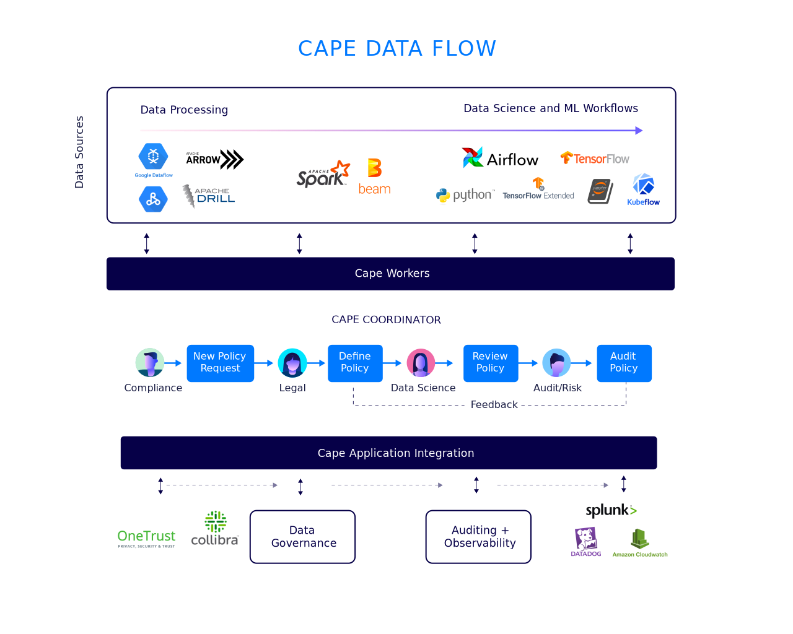

# Roadmap

Cape Privacy's software is currently in alpha state. This document describes Cape Privacy's goals, and some upcoming features.

## The goal

Cape Privacy aims to enable better and more privacy compliant data science, and to make this accessible to a wide range of users (not just engineers). 

Through our open source approach, we ensure our own code and tools are transparent and auditable.

### Architecture

Cape Privacy provides [Cape Coordinator](/cape-core/coordinator/), to manage policy and users. This will interact with the Cape Privacy libraries (such as [Cape Python](/libraries/cape-python/)) through a workers interface, and with your own data services through an API.

### Data flow

Data will flow between the following elements of Cape Privacy's architecture:

* Cape workers pass policy information to Cape libraries.
* Cape Coordinator has an internal policy management workflow, from a request for new policy, through collaborating review, to using the policy to control how the libraries transform your data.
* The Cape API will exchange information relevant to auditors with your own monitoring tools.

## Upcoming features

### Cape Python

* Reversible tokenisation: allow reversing of tokenization to reveal the raw value.
* Policy audit logging: create logging hooks to allow audit logs for policy downloads and usage in Cape Python.
* Expand pipeline integrations: add Apache Beam, Apache Flink, Apache Arrow Flight or Dask integration as another pipeline we can support, either as part of Cape Python or in its own separate project.

### Cape Core

* Audit logging configuration: set up configuration for how and where you log actions in Cape Coordinator, such as project and policy creation, user changes and user actions in Cape.
* Governance tooling: integrate basic data governance information to be used within Cape Coordinator for writing better policy, with a possible integration with Apache Atlas or other open-source governance tools.
* Pipeline orchestrator integration: ability to connect with Spark orchestration tools (such as YARN, Mesos, and Airflow) and pull information on jobs that are running for easier management of running Spark installations.